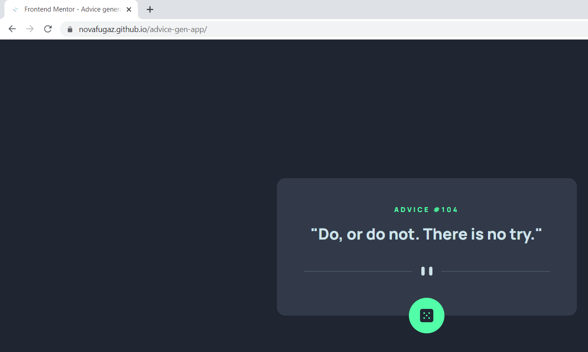
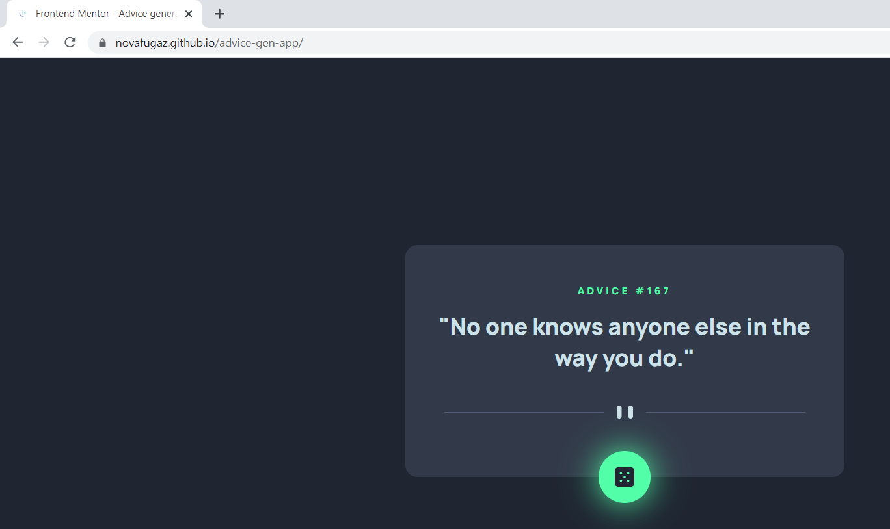
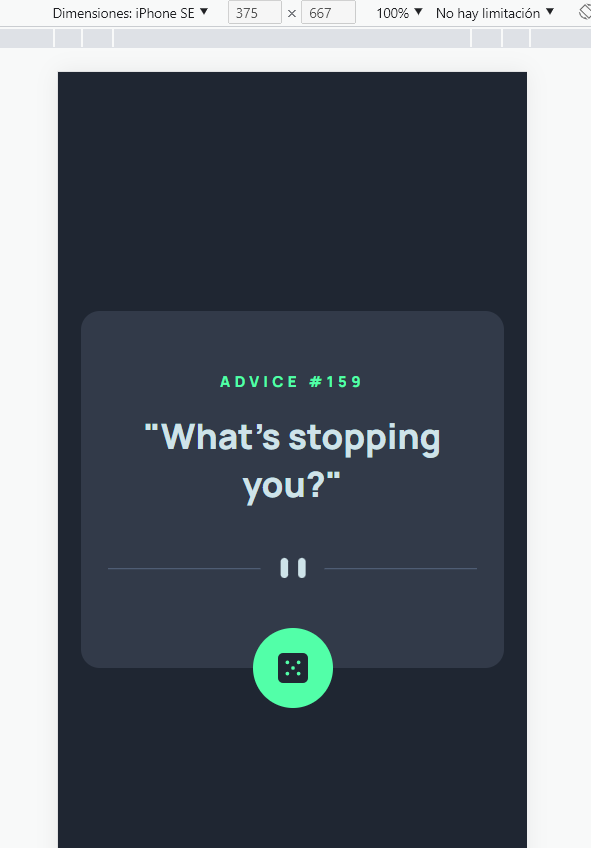

# Frontend Mentor - Advice generator app solution

This is a solution to the [Advice generator app challenge on Frontend Mentor](https://www.frontendmentor.io/challenges/advice-generator-app-QdUG-13db). Frontend Mentor challenges help you improve your coding skills by building realistic projects.

## Table of contents

- [Overview](#overview)
  - [The challenge](#the-challenge)
  - [Screenshot](#screenshot)
  - [Links](#links)
- [My process](#my-process)
  - [Built with](#built-with)
  - [What I learned](#what-i-learned)
  - [Useful resources](#useful-resources)
- [Author](#author)


## Overview

### The challenge

Users should be able to:

- View the optimal layout for the app depending on their device's screen size
- See hover states for all interactive elements on the page
- Generate a new piece of advice by clicking the dice icon

### Screenshot

The app was created using React. It has the functionality and it works as intended. I had some issues getting the favicon but I converted it to .ico and changed the name and worked like a charm.








### Links

- Solution URL: [GitHub - Code](https://github.com/NovaFugaz/advice-gen-app)
- Live Site URL: [Live Site - GH Pages](https://novafugaz.github.io/advice-gen-app/)

## My process

### Built with

- HTML5
- CSS custom properties
- CSS Grid
- [React](https://reactjs.org/) - JS library

### What I learned

First of all, I had never done before anything using React, so everything was new.

It was interesting to read this.

```html
This HTML file is a template.
If you open it directly in the browser, you will see an empty page.
```

It was also interesting to read this, as I was not accustomed to make this imports in the "header" of the js.

```js
import React, {useState, useEffect} from 'react'
import dividerDesktop from './img/pattern-divider-desktop.svg'
import dividerMobile from './img/pattern-divider-mobile.svg'
import dice from './img/icon-dice.svg'
import axios from 'axios'
```

Also the structure of the React App was interesting to see. 

### Useful resources

- [Advice Generator App with React](https://www.youtube.com/watch?v=KYOi96jzPSA)) - This video helped me to do this challenge with React, as I had no previous experience with it.

## Author

- Website - [My GitHub, ig](https://github.com/NovaFugaz)
- Frontend Mentor - [@NovaFugaz](https://www.frontendmentor.io/profile/NovaFugaz)
- Twitter - [@ARagingStorm](https://www.twitter.com/ARagingStorm)
